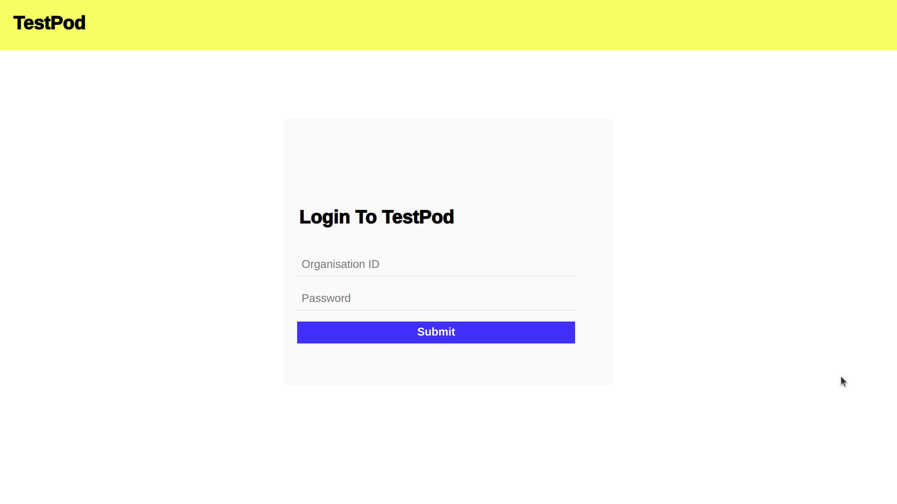
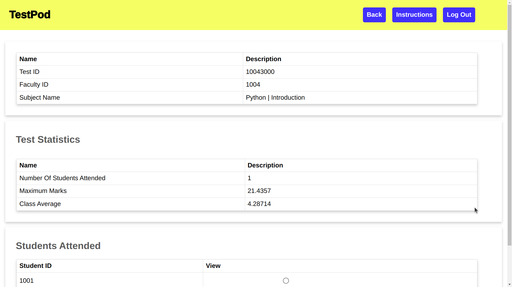

# TestPod

Automated Evaluation Of Essay-Based Questions Based On Natural Language Processing (AI)

## Video Demonstration

https://www.youtube.com/watch?v=3l3mN8IC6Ps

## Abstract

- One of the most crucial aspects of a teaching faculty is to correct the answer sheets
- With a curriculum driven by tests and scoring, examinations have stood as the backbone of the education industry.
- Teaching faculty spend an enormous amount of time for verification and assigning the scores to each student. The following action is a limitation as the faculty can focus on other aspects of teaching and enriching the students.
- The application focuses on a novel methodology to automate the correction for subjective-based questions and answers using NLP Techniques.

## Application Workflow

- The major stakeholders in the application are students and faculty. The faculty is capable of creating a test, monitoring the automated evaluation of each student, and seeing the statistics of the test. The student can logon to the application, attend the test by submitting the test ID, and submit the test for automated evaluation.

- The model is built using Apache OpenNLP. An answer is decomposed into a set of sentences, and sentences are decomposed into tokens. The model decomposes the paragraph into sentences. The set of sentences in an answer goes through text transformation, which includes the removal of trailing spaces and case conversion. Following the transformation of the set of sentences, the text is fed as input to a part-of-speech tagger, which tags the tokens with the appropriate tag.

- The mentioned process is performed on the faculty answer script to generate a skeleton that includes the expected answers. When a student submits an answer, the answer is transformed into a skeleton of tags and tokens, compared with the faculty answer script, and evaluated. The final score is calculated using a weighted average.

## Tools & Technologies Used

| Purpose            | Name                                      |
| ------------------ | ----------------------------------------- |
| Web Framework      | Spring MVC                                |
| Front-End          | JSP & JSTL                                |
| Database           | MYSQL                                     |
| NLP                | Apache Open NLP                           |
| Sentence Dedection | SentenceDetectorME (OpenNLP)              |
| POS Tagger         | en-pos-maxent (Maximum entropy Algorithm) |
| Remarks Generation | Rule-based fuzzy Logic                    |

## Modules

| Purpose                | Description                                                                             |
| ---------------------- | --------------------------------------------------------------------------------------- |
| Home page              | Contains information regarding the application                                          |
| Login                  | Common login for faculty and student                                                    |
| Faculty Dashboard      | Contains details about the faculty and the tests that were administered                 |
| Exam Dashboard         | Test statistics and a list of students who took the test are projected                  |
| Auto Generated Report  | Summary of the student's performance, step-by-step evaluation of the student report     |
| Examination Centre     | Evaluates the presence of the student's ID in the test and generates the question paper |
| Digital Question Paper | Platform for the student to answer the questions                                        |

### Home page

### Login

### Faculty Dashboard

### Exam Dashboard

### Auto Generated Report

### Examination Centre

### Digital Question Paper

## Algorithm

- The answer is broken down into
  sentences, using the delimiter (.)
- The broken array of sentences is
  parsed using POS sentence tagging
- The sentences are mapped to the
  token as <POS Tag, Token> mapping
- For each sentence, the sentence is
  iterate through the resources
  provided to the model for analysis and
  evaluation
- An intermediate output in the form
  of an array of boolean values are generated for further processing by rule-based NLP Techniques
- The intermediate output is fed to a fuzzifier to generate fuzzy sets for
  discrete evaluation and using hierarchical-based valuation
- Finally, the score for the submitted answer is generated using the
  weighted average technique from the discrete score from the fuzzy sets

## Process Flow

- The application is built using Apache OpenNLP, an NLP tool built for Java
  applications
- The major stakeholder of the application are the faculty and the
  student. The faculty feeds the question and the respective answer key to
  the application
- The uploaded questions and answers are processed
  respectively
- Every test has a test ID, a unique primary key to map the
  question with the answer.
- The questions for the test are saved in
  RDBMS. The answers are processed using the core NLP package in the
  application
- The answer key is processed, tokenized, and POS tagged. The
  structured answer is stored in a text file along with the metadata of the
  file
- When a student attempts the exam, the answers are processed,
  tokenized and POS tagged. The structured answer script saved as a file is
  decoded to proper data structures with the help of metadata
- A container (Java bean) is created to save the information of the structure. Two
  containers, one for faculty and another for a student are created
- The student container is passed to the faculty container to find the similarity index
  matrix
- The matrix is de-fuzzified using fuzzy logic and appropriate marks
  are allocated for each question using weighted average method
